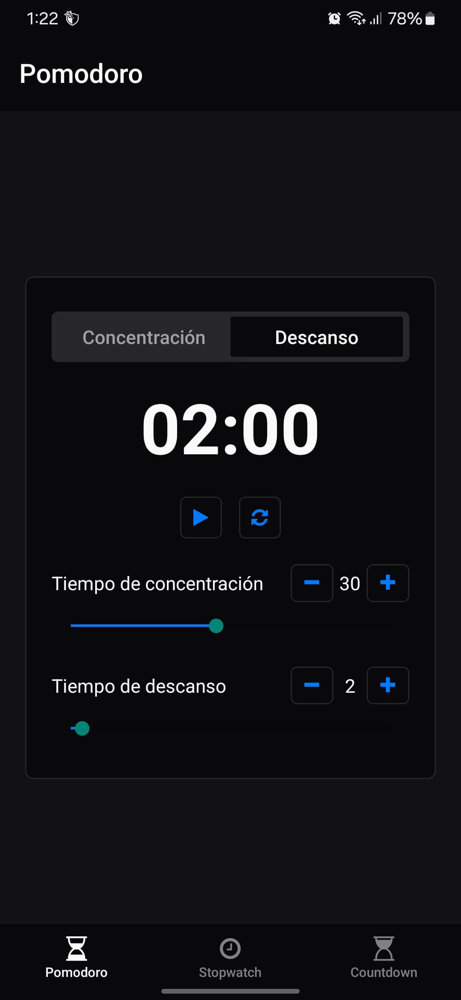

# TIMERAPP

## Overview
TIMERAPP is a comprehensive time management application built with React Native and Expo. It offers three essential timing tools to boost your productivity and help you manage your time effectively.

## App Screenshots

<p align="center">
  
  
  
</p>
<p align="center">
  
  
  
</p>


## Features

### 1. Pomodoro Timer
- **Focus Sessions**: Customizable work periods (default: 25 minutes)
- **Break Sessions**: Adjustable break periods (default: 5 minutes)
- **Auto-transition**: Seamlessly switch between work and break periods
- **Visual and Audio Alerts**: Get notified when a session ends

### 2. Countdown Timer
- **Flexible Time Setting**: Set hours, minutes and seconds precisely
- **Pause and Resume**: Control your timer as needed
- **Reset Capability**: Start over or set a new time
- **Completion Alerts**: Audio notification when timer ends

### 3. Stopwatch
- **Precision Timing**: Measure elapsed time with centisecond accuracy
- **Lap Marking**: Record multiple time points during a session
- **Custom Labels**: Add notes to each lap for better tracking
- **Scrollable History**: Review all recorded laps

## Technology Stack

- **React Native**: Core framework
- **Expo**: Development platform
- **TypeScript**: Type-safe coding
- **NativeWind**: Tailwind CSS for React Native
- **React Navigation**: Navigation system
- **Expo Router**: File-based routing
- **Expo AV**: Audio playback for alerts

## Installation

### Prerequisites
- Node.js (v14.0.0 or later)
- npm or yarn
- Expo CLI
- iOS/Android development environment

### Setup
1. Clone the repository
   ```
   git clone https://github.com/SevenDogsNTwoCats/timerapp.git
   cd timerapp
   ```

2. Install dependencies
   ```
   npm install
   # or
   yarn install
   ```

3. Start the application
   ```
   npm run dev
   # or
   yarn dev
   ```
   
4. Run on specific platforms
   ```
   # For Android
   npm run android
   
   # For iOS
   npm run ios
   
   # For web
   npm run web
   ```

## Usage Guide

### Pomodoro Timer
1. Select "Pomodoro" from the tab navigation
2. Choose between Focus and Break modes
3. Adjust session durations using the sliders
4. Tap Play to start the timer
5. Receive notifications when sessions end

### Countdown Timer
1. Navigate to "Countdown" tab
2. Set your desired time using the hour, minute, and second controls
3. Press Start to begin countdown
4. Use Pause to temporarily stop the timer
5. Reset to clear and start over

### Stopwatch
1. Go to the "Stopwatch" tab
2. Press Play to begin timing
3. Use the Lap button to mark specific times
4. Add custom labels to your laps
5. View your lap history in the scrollable section

## Building for Production

To build the app for distribution:

```
npm run build
# or
eas build
```

## Try APK

🤖 Open this link on your Android devices (or scan the QR code) to install the app:
https://expo.dev/accounts/ae9/projects/pomodoro/builds/3d3e83e9-1db3-4892-8995-bc41e0d8a86e
or scan QR Code


## Contributing

Contributions are welcome! Please feel free to submit a Pull Request.

<!-- ## License

This project is licensed under the MIT License - see the LICENSE file for details. -->

## Acknowledgments

- Built using React Native and Expo framework
- Uses various React Native Primitives for UI components
- Sound effects from [source]


